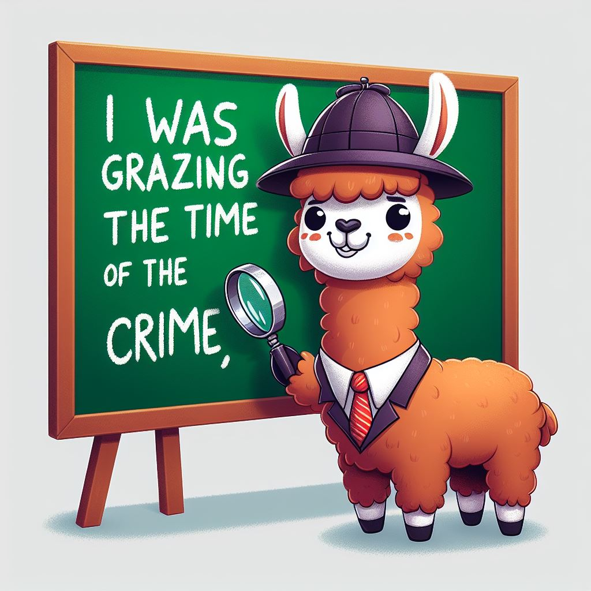

<div align="center">


</div>

# Alilama (Transformer with ALiBi positional encoding and some tricks from Llama2)

An easy to understand Transformer model implementation. This repo is designed so that it is easy for you to train your own custom datasets.

# model Architecture
As mentioned in the talk (Cybersecurity and AI), i adapted the [standart transformer decoder architecture](https://arxiv.org/abs/1706.03762), except that i used relative positioning as described in [ALiBi](https://arxiv.org/abs/2108.12409). I also moved the batch norm layers in front of the Attention and MLP layers. For weight initalization i used nn.init.xavier_normal_, as mentioned in [this paper](https://www.cs.toronto.edu/~mvolkovs/ICML2020_tfixup.pdf). To reduce model size, i used [weight tying](https://benjaminwarner.dev/2023/07/28/rest-of-the-transformer) for the input embedding and output projection. I called this model "alilama" because it uses the ALiBi positional encoding and some tricks from the llama2 architecture. To test the implementation, i used the [TinyStories](https://huggingface.co/datasets/roneneldan/TinyStories) dataset. Here is a test story from the "alilama_2M" model i trained (the blue text is written by me, the rest is filled up by the model):

$ \textcolor{blue}{\text{Once}}\ \textcolor{red}{\text{upon}}\ \textcolor{green}{\text{a}}\ \textcolor{orange}{\text{time,}}\ \textcolor{purple}{\text{Tom}}\ \textcolor{brown}{\text{and}}\ \textcolor{cyan}{\text{Lisa}}\ \textcolor{magenta}{\text{found}}\ \textcolor{yellow}{\text{a}}\ \textcolor{blue}{\text{shiny}}\ \textcolor{red}{\text{red}}\ \textcolor{green}{\text{apple.}}\ \textcolor{orange}{\text{They}}\ \textcolor{purple}{\text{both}}\ \textcolor{brown}{\text{wanted}}\ \textcolor{cyan}{\text{it.}}\ \textcolor{magenta}{\text{Tom}}\ \textcolor{yellow}{\text{said,}}\ \textcolor{blue}{\text{"I}}\ \textcolor{red}{\text{found}}\ \textcolor{green}{\text{it}}\ \textcolor{orange}{\text{first!"}}\ \textcolor{purple}{\text{Lisa}}\ \textcolor{brown}{\text{said,}}\ \textcolor{cyan}{\text{"I}}\ \textcolor{magenta}{\text{want}}\ \textcolor{yellow}{\text{it}}\ \textcolor{blue}{\text{too!"}} $ 
 Tom said, "No, it's mine!" They both pulled and pulled, but the apple did not move. Tom and Lisa were sad. They could not play with the apple anymore. They had to find a way to make the apple disappear. They could not agree on what to do. Then, Tom had an idea. He said, "Let's share the apple!" They both agreed. They shared the apple and played together. They were happy and became friends

I also implemented a fast tokenizer based on MinBpe by Andrej karpathy in c++ and connected it using ctypes.

# inference my pretrained models
To try out one of my models, you can open the inference.ipynb file in jupyter and just execute the cells. In the first cell, you can specify the model you want to run. I already trained "alilama_2M.pth" (d_model=128, blocks=8, max_seq_len=128, num_heads=8, hidden_dim=4*d_model) with learning rate 1e^-4. It took around 10 hours to train on my NVIDIA GeForce RTX 3050. I trained for around 4 epochs, so the model saw the complete dataset 4 times. Larger models would give much better results, but unfortunately i don't have the compute for that.. In the second cell, you can specify the "prompt" for the model. I am not completely satisfied with the performance of the model, even tho it seems to perform as well as a model of the same size from the TinyStories paper. There is definitely some improvement we can still do. For example, using warmup steps/cosine learning rate schedule as used in the training of Llama2 would be a good starting point. I am probably gonna include it in the future. Also, obviously training larger models would give much better results, but unfortunately i don't have enough compute for this.

# train on your own Data
## Step 1: build Your Dataset

You can put any data you want into the `data_raw` folder. Make sure to name it `train_data.txt`. This file can contain basically any text you want. The model will later learn from it and try to generate new data. Here are a few examples on how this could be useful.

1. **Language Translation**: For example you could build up a dataset that looks like this:

    "ENGLISH: A man goes to the bar and drinks a beer
    GERMAN: Ein Mann geht in die Bar und trinkt ein Bier
    ENGLISH: a dog barks at a man, who walks down the street
    GERMAN: Ein Hund ...   "

2. **Code Generation**: Feed in the entire linux kernel and see what the model spits out

3. **Music Generation**: Encode music into a stream of tokens and let the model generate some beautiful tracks (maybe)

To kickstart, use the following command to download the TinyStories dataset:

```bash
python data/data_raw/downloadTinyStories.py
```

## Step 2: train the tokenizer

execute 

```bash
python data/tokenizeData.py
```

This can take a long time (for the TinyStories dataset up to an hour)

## Step 3: train the model

execute 

```bash
python train.py
```

This will train the model. You can adjust the model and training parameters in TRAINCONFIG.py

# inference your model

To test your trained model, see the [inference](inference.ipynb) notebook. Specify the start string and execute the model on it. You can see the already trained models in the models folder.

# main sources
The idea repo is inspired by an [implementation of the llama model](https://github.com/karpathy/llama2.c) from Andrej Karpathy, however we implemented our own model that comes close to the performance of the Llama model, while beeing much easier to understand and adapt. To understand the model architecture and gradient descent better, i can recommend these two videos (in this order):

[Understanding automatic differentiation]() (by Andrej Karpathy)

[Understanding the basic transformer architecture]() (by Andrej Karpathy)

# all sources
### papers

1. LLama2 paper
- **Title:** [Llama 2: Open Foundation and Fine-Tuned Chat Models](https://arxiv.org/abs/2307.09288)
- **Authors:** Andrew Brock, David Ha, Chris Olah

2. GPT-2 paper
    - **Title:** [Language Models are Unsupervised Multitask Learners](https://d4mucfpksywv.cloudfront.net/better-language-models/language_models_are_unsupervised_multitask_learners.pdf)
    - **Authors:** OpenAI (Alec Radford, Jeffrey Wu, Rewon Child, David Luan, Dario Amodei, Ilya Sutskever)

3. main Tranformer architecture
    - **Title:** [Attention Is All You Need](https://arxiv.org/abs/1706.03762)
    - **Authors:** Ashish Vaswani, Noam Shazeer, Niki Parmar, Jakob Uszkoreit, Llion Jones, Aidan N. Gomez, Lukasz Kaiser, Illia Polosukhin
    - **Link:** [arXiv](https://arxiv.org/abs/1706.03762)

5. Alibi Paper
    - **Title:** [Train Short, Test Long: Attention with Linear Biases Enables Input Length Extrapolation](https://arxiv.org/abs/2108.12409)
    - **Authors:** Ofir Press, Noah A. Smith, Mike Lewis
    - **Link:** [arXiv](https://arxiv.org/abs/2108.12409)

6. Rotary Positional Embedding
    - **Title:** [RoFormer: Enhanced Transformer with Rotary Position Embedding](https://arxiv.org/abs/2104.09864)
    - **Authors:** Jianlin Su, Yu Lu, Shengfeng Pan, Ahmed Murtadha, Bo Wen, Yunfeng Liu

7. Weight Tying Understanding
    - **Title:** [Creating a Transformer From Scratch, part 2](https://benjaminwarner.dev/2023/07/28/rest-of-the-transformer)
    - **Author:** Benjamin Warner

8. Weight Initialization Scheme
    - **Title:** [Improving Transformer Optimization Through Better Initialization](https://www.cs.toronto.edu/~mvolkovs/ICML2020_tfixup.pdf)
    - **Authors:** Xiao Shi Huang, Felipe Perez, Jimmy Ba, Maksims Volkovs

9. ResNet
    - **Title:** [Deep Residual Learning for Image Recognition](https://arxiv.org/abs/1512.03385)
    - **Authors:** Kaiming He, Xiangyu Zhang, Shaoqing Ren, Jian Sun

10. Neural Turing Machines
    - **Title:** [Neural Turing Machines](https://arxiv.org/abs/1410.5401)
    - **Authors:** Alex Graves, Greg Wayne, Ivo Danihelka

11. Flash Attention
    - **Title:** [FlashAttention-2: Faster Attention with Better Parallelism and Work Partitioning](https://arxiv.org/abs/2307.08691)
    - **Authors:** Tri Dao

12. TinyStories
    - **Title:** [TinyStories: How Small Can Language Models Be and Still Speak Coherent English?](https://arxiv.org/abs/2305.07759)
    - **Authors:** Ronen Eldan, Yuanzhi Li

### github

1. Alibi GitHub
    - **Title:** Alibi GitHub Repository
    - **Authors:** Jake Tae
    - **Link:** [Alibi GitHub](https://github.com/jaketae/alibi/blob/main/alibi/attention.py)

2. LLama2 Implementation Andrej Karpathy (Llama2.c)
    - **Link:** [GitHub](https://github.com/karpathy/llama2.c)

3. Tokenizer by Andrej Karpathy
    - **Link:** [GitHub](https://github.com/karpathy/minbpe)

### videos

1. Andrej Karpathy Understanding Automatic Gradient Descent
    - **Title:** The spelled-out intro to neural networks and backpropagation: building micrograd
    - **Link:** [YouTube](https://www.youtube.com/watch?v=VMj-3S1tku0&t=1675s)

2. Andrej Karpathy Transformer
    - **Title:** Let's build GPT: from scratch, in code, spelled out
    - **Link:** [YouTube](https://www.youtube.com/watch?v=kCc8FmEb1nY&t=3514s)

3. Origin of the Attention Mechanism
    - **Title:** Stanford CS25: V2 I Introduction to Transformers w/ Andrej Karpathy
    - **Link:** [YouTube](https://www.youtube.com/watch?v=XfpMkf4rD6E&t=1106s)

4. Alibi Explained
    - **Title:** Alibi Explained
    - **Link:** [YouTube](https://www.youtube.com/watch?v=-Kgxv64aG3o&t=1484s)

### rest

1. Strengths Transformer
    - **Link:** [Twitter](https://twitter.com/karpathy/status/1582807367988654081?lang=de)
